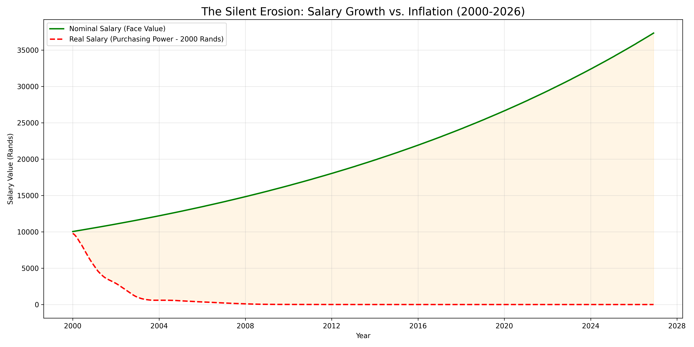

# 💸 The Silent Erosion: Salary vs. Inflation

A data analysis project demonstrating the impact of inflation on personal wealth by comparing nominal salary growth to real purchasing power over a 26-year period.

## 📊 Project Overview

Workers often celebrate annual salary increases, but if inflation rises faster than wages, they are actually becoming poorer. This project simulates a hypothetical worker's career from 2000 to 2026 to visualize the "Inflation Gap"—the difference between the money earned and the money's actual value.

## 📈 Dataset & Simulation

-   **Inflation Data:** Real historical South African inflation rates (2000–2026).
-   **Salary Scenario:**
    -   **Start:** R10,000/month (2000).
    -   **Growth:** 5% annual raise (compounded monthly).
-   **Method:** Data Augmentation (Merging simulated salary data with real inflation data).

## 🛠️ Methodology

1.  **Nominal Salary Calculation:** Compounded monthly raises to show the "face value" of the salary.
2.  **CPI Index Calculation:** A cumulative index calculated from monthly inflation rates to track how the value of currency changes.
3.  **Real Wage Calculation:** Adjusted the nominal salary by the CPI Index to determine "Purchasing Power in 2000 Rands."
    -   _Formula:_ `Real Wage = Nominal Wage / Cumulative Inflation Index`

## 🚀 Key Findings

-   **The Illusion of Wealth:** While the Nominal Salary grew by over 270% (reaching ~R37,000), the Real Purchasing Power was completely eroded (-100%) by the cumulative effect of inflation over the period.
-   **The Inflation Gap:** The visualization highlights the widening gap between what the worker earned (Green Line) and what that money could actually buy (Red Dashed Line).
-   **Critical Lesson:** A standard 5% raise was insufficient to maintain the standard of living given the historical volatility of the South African economy during this period.

## 📁 Files Included

-   `purchasing_power.py`: Python script for salary simulation and inflation adjustment.
-   `purchasing_power_analysis.png`: Dual-line chart visualizing Nominal vs. Real salary over time.

## 🏃 Running the Project

### Prerequisites

-   Python 3.8+
-   Virtual Environment (venv)

### Installation

1.  Clone the repository and navigate to the directory.
2.  Create and activate a virtual environment:
    
    ```bash
    python -m venv venv
    ```
    ```bash
    venv\Scripts\activate
    ```
    

1.  Install required libraries:
    
    ```bash
    
    pip install pandas matplotlib
    ```

### Usage

Run the analysis script:

```bash

python purchasing\_power.py
```
The script will output the starting and ending salary statistics and generate a comparison chart.


